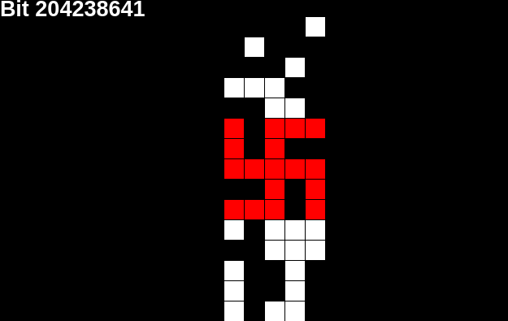

# Swastika_Finder
Finds all the swastikas in the binary representation of pi.

It will output in the Pics/ folder images representing the swastika found. Each black square represent a zero, and each white square represent
a one. The squares are organized in a 5x25 grid. In red is highlighted the swastika.

Example pic : 

